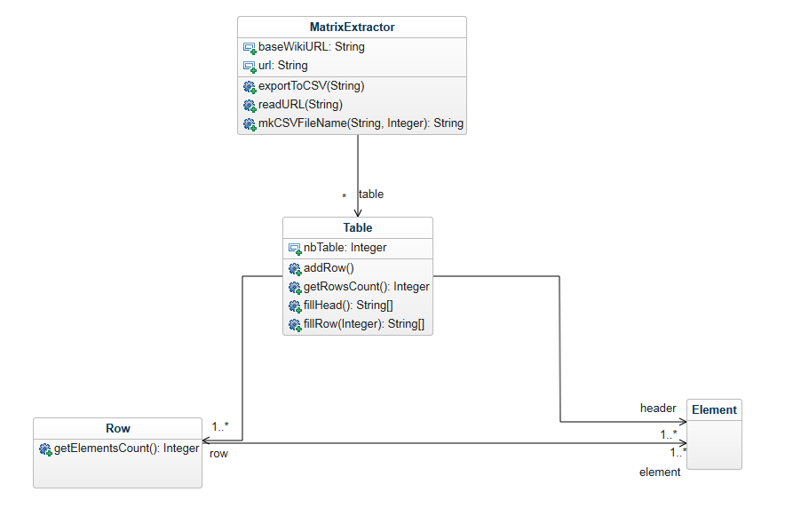

# Wikimatrix Lecacheur

## Objectif

Le logiciel fourni permet de créer un extracteur de tableau provenant de pages wikipedia, pour récupérer leur contenu dans des fichiers csv.

### Diagramme de classes

La classe principale MatrixExtractor réalise la plupart des traitements nécessaires à la lecture du fichier HTML source de la page wikipedia pour récupérer les tableaux, ainsi que l'export de ces tableaux au format csv.

### Démarrer l'extraction

Pour extraire les tableaux des pages wikipedia dont les URL sont fournies dans inputdata/wikiurls.txt, il suffit de lancer la méthode testBenchExtractors() de la classe BenchTest.

## License

Ce projet est enregistré sous une license libre GNU.